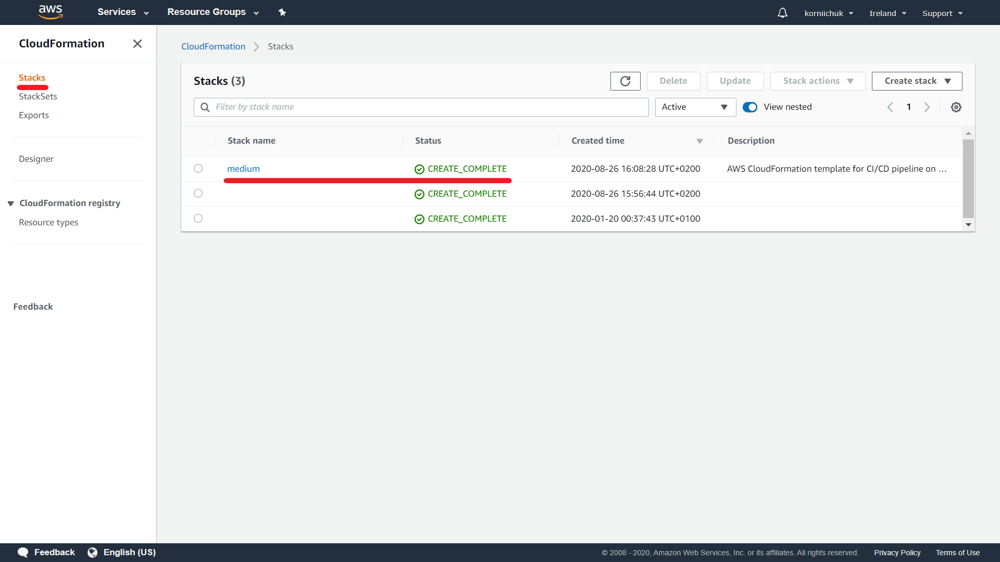
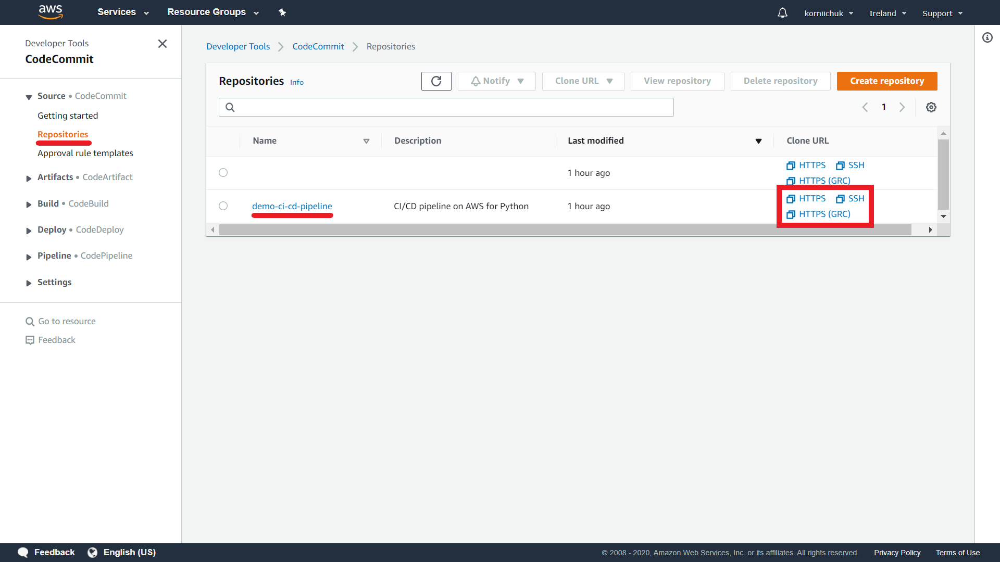
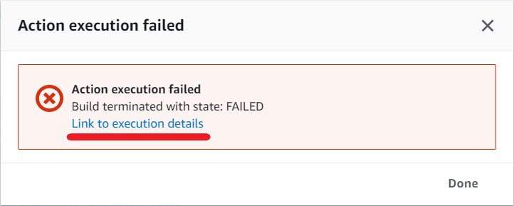

# ci-cd-pipeline-on-aws-for-python
**Name:** ci-cd-pipeline-on-aws-for-python  
**Description:** AWS CloudFormation template for CI/CD pipeline on AWS for Python  
**GitHub:** https://github.com/korniichuk/ci-cd-pipeline-on-aws-for-python

## Table of Contents
* **[Intro](#intro)**
* **[Create CI/CD pipeline. CLI](#create-cicd-pipeline-cli)**
* **[Create CI/CD pipeline. Console](#create-cicd-pipeline-console)**
* **[Validate created pipeline](#validate-created-pipeline)**

## Intro
This repository includes AWS CloudFormation template for CI/CD pipeline on AWS for Python. CI/CD pipeline based on [AWS CodeCommit](https://aws.amazon.com/codecommit/) (à la GitHub), [AWS CodeBuild](https://aws.amazon.com/codebuild/) (à la Jenkins), and [AWS CodePipeline](https://aws.amazon.com/codepipeline/) (continuous delivery) services. You can see visualization below:


CI/CD pipeline validates your Python code against coding style (aka [PEP8](https://www.python.org/dev/peps/pep-0008/)), programming errors, and [cyclomatic complexity](https://en.wikipedia.org/wiki/Cyclomatic_complexity). CI/CD pipeline runs your unit tests. Solution based on [Flake8](https://flake8.pycqa.org/en/latest/) and [Pytest](https://docs.pytest.org/en/stable/) libraries. For more details see `buildspec.yml` file in [ci_cd_pipeline_init_code_20200827.zip](https://s3-eu-west-1.amazonaws.com/korniichuk.share/code/ci_cd_pipeline_init_code_20200827.zip) archive.

## Create CI/CD pipeline. CLI
In a terminal, we can enter the following command:
```
$ aws cloudformation create-stack --stack-name <value> --template-body file://<value> --capabilities CAPABILITY_NAMED_IAM
```

Example:
```
$ git clone https://github.com/korniichuk/ci-cd-pipeline-on-aws-for-python.git
$ cd ci-cd-pipeline-on-aws-for-python
$ aws cloudformation create-stack --stack-name medium --template-body file://ci_cd_pipeline.yaml --capabilities CAPABILITY_NAMED_IAM
```

Example output:
```
{
    "StackId": "arn:aws:cloudformation:eu-west-1:999999999999:stack/medium/4576d190-e731-11ea-925a-0ab221334260"
}
```

**Source:** https://docs.aws.amazon.com/cli/latest/reference/cloudformation/create-stack.html

## Create CI/CD pipeline. Console
Navigate to https://console.aws.amazon.com/cloudformation/. Click `Create stack`:


Select `Upload a template file`. Click `Choose file` and select AWS CloudFormation template from your local machine (e.g. [ci_cd_pipeline.yaml](ci_cd_pipeline.yaml)):


Click `Next`:


Enter `Stack name` (e.g. `medium`). Click `Next`:


Scroll down. Click `Next`:


Scroll down. Select `I acknowledge that AWS CloudFormation might create IAM resources with custom names.` checkbox. Click `Create stack`:


## Validate created pipeline
Navigate to https://console.aws.amazon.com/cloudformation/. Click `Stacks` and validate status of your stack:


Navigate to https://console.aws.amazon.com/codepipeline/. Validate status of your pipeline:


Navigate to https://console.aws.amazon.com/codecommit/. Copy `URL` of your repository:


In a terminal, we need to enter the following command:
```
$ git clone URL
$ cd demo-ci-cd-pipeline
```

Where:
  - `URL` -- URL of your repository from the previous step.

Example:

```
$ git clone https://git-codecommit.eu-west-1.amazonaws.com/v1/repos/demo-ci-cd-pipeline
$ cd demo-ci-cd-pipeline
```

Next we need to change our Python code and send update to AWS CodeCommit repository. For example, you can change code of `sample.py` file to new code with typo:
```
# -*- coding: utf-8 -*-
# Name: sample
# Version: 0.1a2
# Owner: Ruslan Korniichuk

def hello_world():
    return 'Hello, World1'  # Typo is here
```

Commit changes and send to remote repo:
```
$ git commit -am "Test failure"
$ git push origin master
```

Navigate to https://console.aws.amazon.com/codepipeline/. **Wait a few minutes.** You can expect `In progress` status first:


Wait a few minutes more. You can expect `Failed` status:


Select your pipeline and click `Details` in red `Build` block:


Click `Link to execution details`:


Finally, you can see reason of failure. Our new Python code with typo cannot pass unit tests:


## Sources
https://github.com/aws-samples/codepipeline-nested-cfn/blob/master/codepipeline-cfn-codebuild.yml
